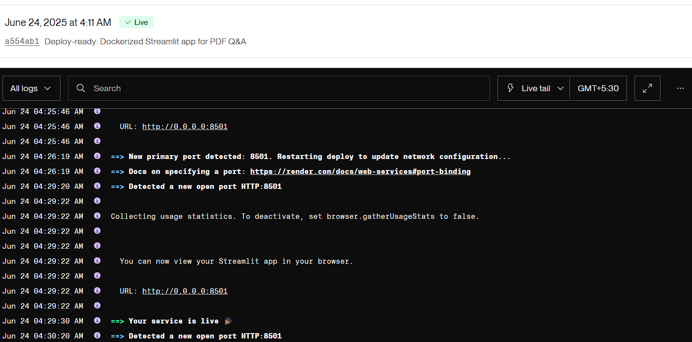

# RAG-Q&A-Conversation

A powerful Retrieval-Augmented Generation (RAG) application that enables conversational question-answering with uploaded PDF documents while maintaining chat history. Built with Streamlit, LangChain, and Groq API for seamless document interaction and intelligent responses.


# Features
- PDF Upload & Processing: Upload multiple PDF files simultaneously for analysis

- Conversational RAG: Ask questions about your documents with context-aware responses

- Chat History Management: Maintains conversation history across sessions with session IDs

- History-Aware Retrieval: References previous conversation context for better responses

- Real-time Processing: Instant document processing and embedding generation

- Multiple Document Support: Handle multiple PDFs in a single session

- Secure API Integration: Protected API key input for Groq services

## 🗂️ Project Structure

| File / Folder         | Purpose                                                |
|-----------------------|--------------------------------------------------------|
| `.devcontainer/`      | VS Code remote container config for reproducible setup |
| `.gitignore`          | Specifies files and folders to be ignored by Git       |
| `Dockerfile`          | Docker instructions for containerizing the app         |
| `README.md`           | Project overview and usage guide (this file)           |
| `app.py`              | Main Streamlit application logic                       |
| `requirements.txt`    | Python dependencies for local and Docker setup         |
| `transformers.pdf`    | Sample PDF file for testing the app                    |

---

 # Technologies Used
 
 | Component              | Technology                        |
|------------------------|-----------------------------------|
| **Frontend**           | Streamlit                         |
| **LLM Framework**      | LangChain                         |
| **Language Model**     | Groq API (Gemma2-9b-It)           |
| **Embeddings**         | HuggingFace (all-MiniLM-L6-v2)    |
| **Vector Database**    | Chroma                            |
| **Document Processing**| PyPDF, RecursiveCharacterTextSplitter |
| **Chat History**       | LangChain ChatMessageHistory       |


# Prerequisites

##  Installation & Setup
### 1. Create virtual environment
python -m venv rag_env


### 2. Install dependencies
pip install -r requirements.txt


### 3. Configure environment variables
Create `.env` file:
- OpenAI
OPENAI_API_KEY

- LangChain
LANGCHAIN_API_KEY
LANGCHAIN_PROJECT

- HuggingFace
HF_TOKEN
HUGGINGFACEHUB_API_TOKEN

- Groq
GROQ_API_KEY

## Usage
1. Start the app:
   
streamlit run app.py

2. Open `http://localhost:8501` in browser
3. Enter Groq API key
4. Upload PDF files
5. Start chatting with your documents!

## 🔧 Configuration
| Parameter          | Value                          | Description                     |
|--------------------|--------------------------------|---------------------------------|
| **Chunk Size**     | 5000 characters               | Document splitting size         |
| **Chunk Overlap**  | 500 characters                | Overlap between document chunks |
| **Embedding Model**| all-MiniLM-L6-v2              | HuggingFace embedding model     |
| **LLM**            | Gemma2-9b-It                  | Groq language model             |

## Key Components
1. **Document Processing**:
   - PDF loading with PyPDFLoader
   - Text splitting with RecursiveCharacterTextSplitter
   - Embedding generation with HuggingFace

2. **Conversational RAG**:
   - History-aware retriever with contextualization
   - Retrieval chain with document context
   - Session-based chat history management

3. **Streamlit UI**:
   - PDF uploader with multi-file support
   - Session ID management
   - Interactive chat interface

# 🐳 Docker Usage (Alternative to Local Setup)
You can also run this app directly via Docker using the public image on Docker Hub.
1. Pull the Docker Image
   - docker pull srishtigarg/rag-pdf-app:latest

2. Run the Docker Container
   - docker run -p 8501:8501 srishtigarg/rag-pdf-app:latest

3. Open Your Browser
   - http://localhost:8501

4. Start Using the App
   - Enter your Groq API Key

   - Upload PDF(s)
  
---

## 🌐 Live Demo on Render

     App is also deployed using **Render** for public access.

### 🔗 Deployment 
    Can access the Streamlit app at: URLhttps://rag-pdf.onrender.com

```text
https://<your-app-name>.onrender.com




